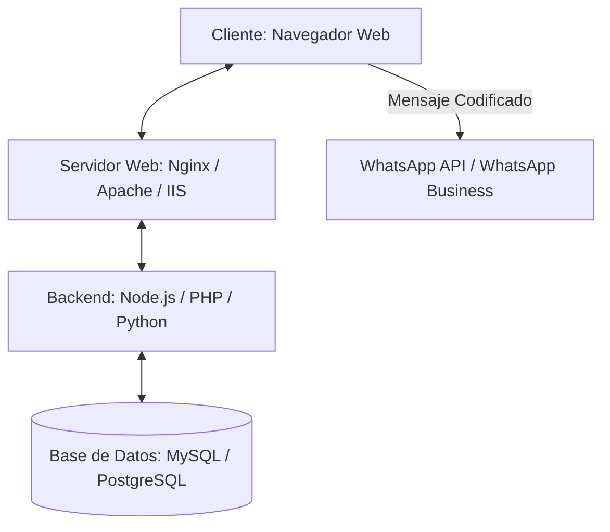
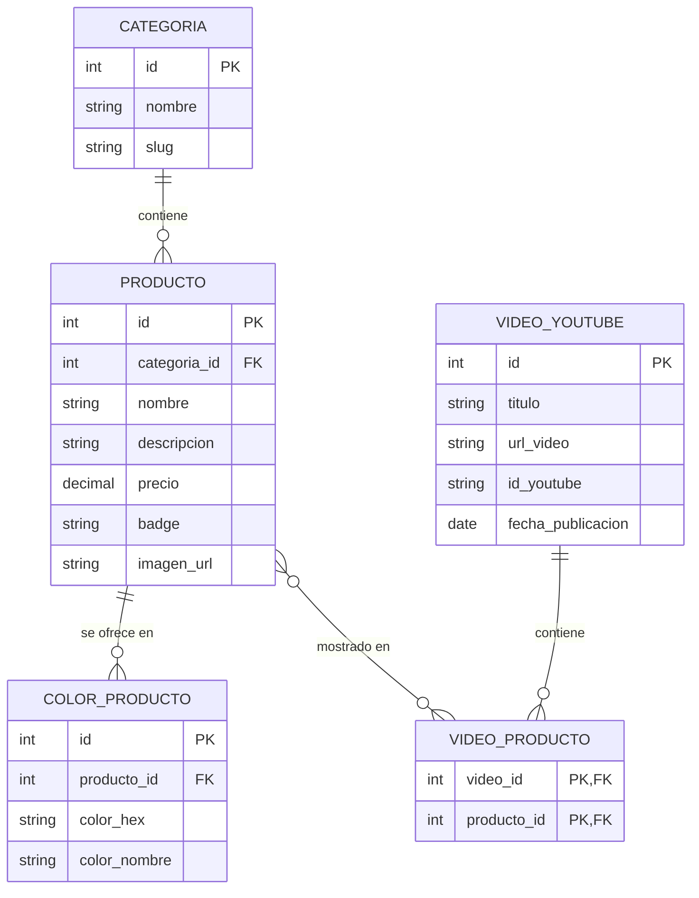

# Documento de Arquitectura y Proyecto: Boutique Norma 👜

Este documento describe la arquitectura de software, la estructura del proyecto y el diseño técnico propuestos para la plataforma interactiva de **Boutique Norma · Bolsas & Accesorios**. Además, integra la documentación de los cambios de diseño recientes realizados en el sitio.

---

## 1. Arquitectura del Sistema 🏗️

Actualmente, el proyecto funciona como una aplicación de frontend estática (HTML5, CSS3 y JavaScript). Para escalar esta solución a un sistema de producción robusto y dinámico, se requiere la siguiente arquitectura:



### 1.1 Servidor Web (Nginx, Apache o IIS)
Para hospedar y servir los archivos del frontend (`index.html`, `style.css`, `script.js` e imágenes), se puede optar por cualquiera de los siguientes servidores web. Aquí detallamos su configuración recomendada:

#### Opción A: Nginx (Recomendado)
Nginx es ideal por su alto rendimiento, bajo consumo de recursos y excelente manejo de archivos estáticos.
* **Configuración del Bloque de Servidor (`nginx.conf`):**
  ```nginx
  server {
      listen 80;
      server_name tu-boutique.com;
      root /var/www/tu-apoyo-digital-premium/demo-boutique;
      index index.html;

      # Servir archivos estáticos directamente con caché optimizada
      location ~* \.(jpg|jpeg|png|gif|ico|css|js)$ {
          expires 30d;
          add_header Cache-Control "public, no-transform";
      }

      location / {
          try_files $uri $uri/ =404;
      }
  }
  ```

#### Opción B: Apache HTTP Server
Apache es altamente modular y fácil de configurar mediante archivos de configuración locales `.htaccess`.
* **Configuración de Directiva (`httpd.conf` o `.htaccess`):**
  ```apache
  <Directory "/var/www/tu-apoyo-digital-premium/demo-boutique">
      AllowOverride All
      Require all granted
      DirectoryIndex index.html
  </Directory>
  ```

#### Opción C: IIS (Internet Information Services - Windows)
La opción por defecto si el servidor corre en entornos Windows Server.
* **Configuración del Archivo `web.config`:**
  ```xml
  <?xml version="1.0" encoding="utf-8"?>
  <configuration>
    <system.webServer>
      <defaultDocument>
        <files>
          <clear />
          <add value="index.html" />
        </files>
      </defaultDocument>
      <staticContent>
        <clientCache cacheControlMode="UseMaxAge" cacheControlMaxAge="30.00:00:00" />
      </staticContent>
    </system.webServer>
  </configuration>
  ```

---

### 1.2 Base de Datos 🗄️
En la demo actual, el catálogo de productos y los videos están definidos como objetos estáticos en JavaScript. Para producción, implementaremos una base de datos relacional (**MySQL** o **PostgreSQL**) que permita añadir, borrar o editar productos en tiempo real desde un panel de administración.

#### Modelo Entidad-Relación Recomendado:



* **Categorías:** Permite clasificar si es bolsa, mochila, monedero, etc.
* **Productos:** Almacena la información principal de cada artículo.
* **Colores de Producto:** Relación uno a muchos para saber que un mismo artículo se ofrece en múltiples variantes cromáticas.
* **Videos de YouTube:** Almacena los videos publicados.
* **Video Producto:** Tabla intermedia muchos a muchos para mapear los productos mostrados en cada video.

---

### 1.3 Integración con WhatsApp 💬
El flujo de venta se basa en conectar la selección del usuario directamente con el chat de ventas de la boutique.

1. **Integración Directa (Lado del Cliente):**
   * El cliente agrega productos al carrito.
   * Al confirmar el pedido, JavaScript toma el arreglo del carrito y concatena los detalles (nombre, cantidad, precio, color) en una sola cadena de texto.
   * Se aplica la función `encodeURIComponent(mensaje)` para asegurar que caracteres especiales (como saltos de línea, espacios o emojis) viajen seguros en la URL.
   * Se redirige al enlace: `https://wa.me/521XXXXXXXXXX?text=MENSAJE_CODIFICADO`.
2. **Escalabilidad (WhatsApp Business API oficial de Meta):**
   * Para automatizar la confirmación de pedidos, se puede conectar un Backend a la **Cloud API de WhatsApp**.
   * Al recibir una orden de compra, el servidor envía un mensaje estructurado de confirmación (Template Message) directamente al número del cliente de forma automatizada y registra la venta en la Base de Datos.

---

## 2. Estructura del Proyecto 📁

La estructura de archivos de la boutique y su integración en el espacio de trabajo se compone de la siguiente manera:

```text
tu-apoyo-digital-premium/
│
├── css/                             # Estilos globales de la página de portafolio
├── js/                              # Lógica global de la página de portafolio
├── index.html                       # Página de aterrizaje principal (Landing Page de Demos)
├── style-v2.css                     # Estilos alternativos de la landing principal
│
└── demo-boutique/                   # Carpeta raíz de la aplicación Boutique Norma
    │
    ├── index.html                   # Interfaz de la Boutique (Estructura y contenido principal)
    ├── style.css                    # Estilos visuales, variables y animaciones (CSS Vanilla)
    ├── script.js                    # Interactividad, gestión del carrito, filtros y buscador
    │
    └── images/                      # Almacén de activos visuales locales
        └── bolsa_sofia.jpg          # Fotografía premium de la Bolsa Sofía Elegante en Hero
```

---

## 3. Documento de Cambios de Diseño Recientes (Boutique Norma) 👜

A continuación se detalla la documentación del rediseño estético y funcional aplicado recientemente en la plataforma para mejorar su aspecto visual y experiencia de usuario.

---

### 3.1 El Nuevo Esquema de Colores (Dusty Rose & Champagne) 🎨

Hemos reemplazado los antiguos tonos (arena y gris carbón oscuro) por una combinación mucho más moderna, sofisticada y premium basada en **Dusty Rose (Rosa Viejo)** y **Champagne Gold (Oro Champaña)**. Esta combinación es muy utilizada en boutiques de accesorios de alta gama.

#### Paleta de Colores en [style.css](file:///C:/Users/carlo/desarrollo/tu-apoyo-digital-premium/demo-boutique/style.css#L5-L37)
Modificamos las variables personalizadas (CSS Custom Properties) en el bloque `:root`. Esto es excelente porque te permite cambiar el color de toda la aplicación modificando un solo lugar:

```css
:root {
  --color-bg: #fcfaf9;            /* Fondo: tono crema rosado muy suave y limpio */
  --color-surface: #ffffff;       /* Fondo de tarjetas y elementos interactivos */
  --color-surface-soft: #f7f0ee;  /* Variación suave de superficie */
  --color-border: #efe5e3;        /* Bordes y líneas divisorias discretas */
  --color-text: #3c2c2b;          /* Texto principal: carbón cálido (no negro puro, para evitar fatiga) */
  --color-text-muted: #826e6c;    /* Texto secundario o descriptivo */
  
  --color-primary: #b87367;       /* Primario: Dusty Rose (Rosa Viejo Elegante) */
  --color-primary-hover: #9c5d52; /* Primario Hover: Versión más intensa para efectos de cursor */
  --color-accent: #d4a373;        /* Acento: Champagne Gold (Oro suave para precios y etiquetas) */
  --color-accent-light: #fbf0eb;  /* Fondo claro de realce */
}
```

> [!TIP]
> **Mejor Práctica de Diseño (UI)**
> Evita siempre el negro puro (`#000000`) para textos largos. Usar un carbón cálido o café muy oscuro (como `#3c2c2b`) suaviza la lectura y le da un aspecto mucho más costoso y premium a la interfaz.

---

### 3.2 Reemplazo del Círculo Abstracto por Imagen Real 🎒

El círculo con la animación original de giro a 45° no dejaba del todo claro qué producto se estaba exhibiendo en la sección de héroe. Lo reemplazamos por una imagen real del producto estrella: la **Bolsa Sofía Elegante**.

#### La Nueva Imagen del Bolso
Esta es la imagen premium que generamos y que ya se encuentra en el directorio local de imágenes del proyecto en `demo-boutique/images/bolsa_sofia.jpg`.

#### Cambios en el Código HTML
En [index.html](file:///C:/Users/carlo/desarrollo/tu-apoyo-digital-premium/demo-boutique/index.html#L62-L73) cambiamos el div vacío que simulaba el círculo abstracta (`<div class="showcase-circle"></div>`) por una estructura semántica ideal para SEO visual y rendimiento:

```html
<!-- APRENDIZAJE: Reemplazamos el círculo abstracto original por un contenedor de imagen semántico para mostrar un producto real y mejorar la experiencia del usuario. -->
<div class="showcase-image-wrapper">
  
</div>
```

#### Cambios en el Código CSS
En [style.css](file:///C:/Users/carlo/desarrollo/tu-apoyo-digital-premium/demo-boutique/style.css#L430-L488) reemplazamos las reglas del círculo por las de la imagen y le añadimos una animación de zoom sutil y elegante:

```css
/* Contenedor de la imagen. Se posiciona de forma absoluta cubriendo toda la tarjeta */
.showcase-image-wrapper {
  position: absolute;
  top: 0;
  left: 0;
  width: 100%;
  height: 100%;
  z-index: 0;
  overflow: hidden;
  background-color: var(--color-surface-soft);
}

/* La imagen en sí. 'object-fit: cover' ajusta y recorta la imagen proporcionalmente */
.showcase-img {
  width: 100%;
  height: 100%;
  object-fit: cover;
  transition: var(--transition-smooth); /* Animación fluida de 0.3s definida en variables */
}

/* ZOOM SUAVE AL HACER HOVER: 
   Cuando pasas el ratón sobre la tarjeta (showcase-card), la imagen se amplía un 8% (scale(1.08)).
   Esto le otorga dinamismo y vida a la página sin perder legibilidad. */
.showcase-card:hover .showcase-img {
  transform: scale(1.08);
}
```

> [!NOTE]
> **Degradado Oscuro para Legibilidad**
> Para garantizar que el texto blanco del título y el precio sobre la tarjeta se lean perfectamente en cualquier fondo, ajustamos el degradado `.showcase-card::before` con un tono que combina con nuestra nueva paleta: `linear-gradient(0deg, rgba(60, 44, 43, 0.8) 0%, rgba(60, 44, 43, 0.3) 60%, rgba(60, 44, 43, 0) 100%)`.

---

### 3.3 ¿Cómo subirlo a tu Repositorio en GitHub? 🚀

Dado que agregamos una carpeta nueva con la imagen (`demo-boutique/images/`), asegúrate de ejecutar los siguientes comandos en tu terminal de Git dentro de la carpeta del proyecto para subir todos los cambios de forma correcta:

1. **Revisar archivos modificados:**
   ```bash
   git status
   ```
2. **Agregar todos los archivos nuevos y modificados al stage:**
   ```bash
   git add demo-boutique/
   ```
3. **Hacer el commit con un mensaje descriptivo de lo que aprendiste hoy:**
   ```bash
   git commit -m "style: cambiar esquema de colores a Dusty Rose e integrar imagen real en Hero con zoom interactivo"
   ```
4. **Subir los cambios a GitHub:**
   ```bash
   git push origin main
   ```
